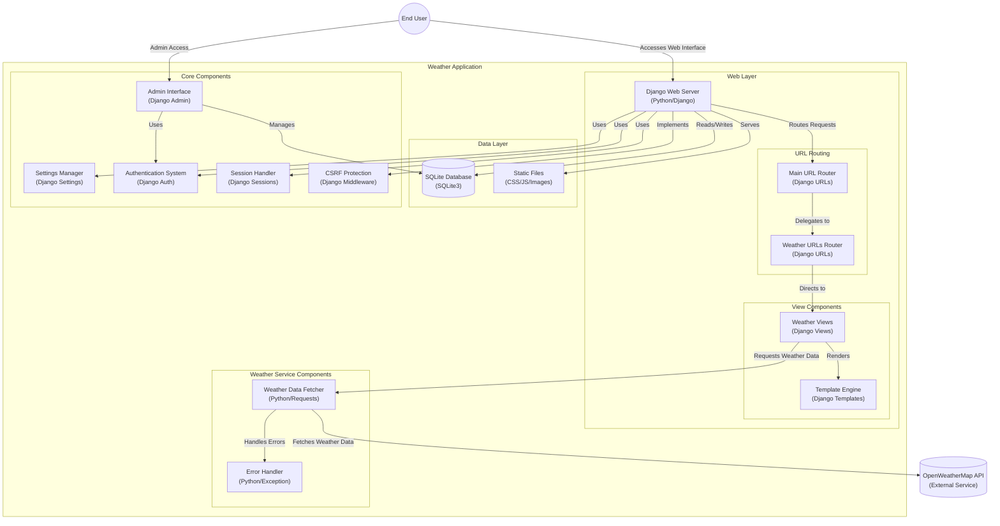

```mermaid
graph TB
    User((End User))
    OpenWeatherAPI[("OpenWeatherMap API<br>(External Service)")]

    subgraph "Weather Application"
        subgraph "Web Layer"
            WebServer["Django Web Server<br>(Python/Django)"]
            
            subgraph "URL Routing"
                MainURLRouter["Main URL Router<br>(Django URLs)"]
                WeatherURLRouter["Weather URLs Router<br>(Django URLs)"]
            end

            subgraph "View Components"
                WeatherViews["Weather Views<br>(Django Views)"]
                TemplateEngine["Template Engine<br>(Django Templates)"]
            end
        end

        subgraph "Data Layer"
            SQLiteDB[("SQLite Database<br>(SQLite3)")]
            StaticFiles["Static Files<br>(CSS/JS/Images)"]
        end

        subgraph "Core Components"
            Settings["Settings Manager<br>(Django Settings)"]
            AdminInterface["Admin Interface<br>(Django Admin)"]
            AuthSystem["Authentication System<br>(Django Auth)"]
            SessionHandler["Session Handler<br>(Django Sessions)"]
            CSRFProtection["CSRF Protection<br>(Django Middleware)"]
        end

        subgraph "Weather Service Components"
            WeatherDataFetcher["Weather Data Fetcher<br>(Python/Requests)"]
            ErrorHandler["Error Handler<br>(Python/Exception)"]
        end
    end

    %% User Interactions
    User -->|"Accesses Web Interface"| WebServer
    
    %% Web Layer Flow
    WebServer -->|"Routes Requests"| MainURLRouter
    MainURLRouter -->|"Delegates to"| WeatherURLRouter
    WeatherURLRouter -->|"Directs to"| WeatherViews
    WeatherViews -->|"Renders"| TemplateEngine
    
    %% Weather Service Flow
    WeatherViews -->|"Requests Weather Data"| WeatherDataFetcher
    WeatherDataFetcher -->|"Fetches Weather Data"| OpenWeatherAPI
    WeatherDataFetcher -->|"Handles Errors"| ErrorHandler
    
    %% Core Component Integration
    WebServer -->|"Uses"| Settings
    WebServer -->|"Uses"| SessionHandler
    WebServer -->|"Implements"| CSRFProtection
    WebServer -->|"Uses"| AuthSystem
    
    %% Data Layer Integration
    WebServer -->|"Serves"| StaticFiles
    WebServer -->|"Reads/Writes"| SQLiteDB
    AdminInterface -->|"Manages"| SQLiteDB
    
    %% Authentication Flow
    User -->|"Admin Access"| AdminInterface
    AdminInterface -->|"Uses"| AuthSystem
```
