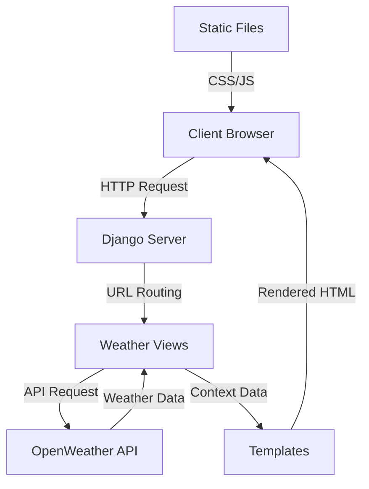
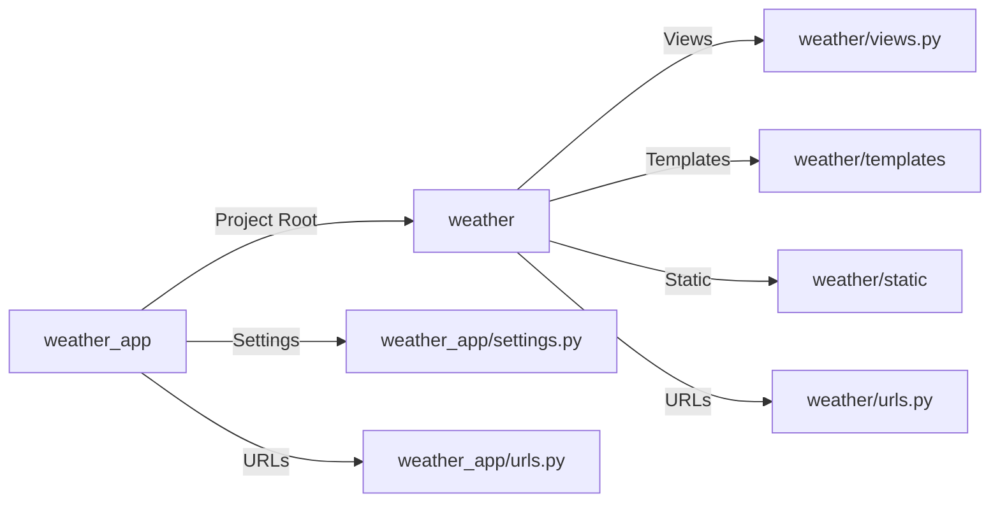

# 🌦️ Premium Weather Dashboard


> A sophisticated weather application that provides real-time weather data with a premium user interface and seamless experience.

## Screenshots


##  Features

- 🔍 Real-time weather data search by city
- 🌡️ Comprehensive temperature metrics
- 💨 Detailed wind information
- ☁️ Cloud coverage visualization
- 🌅 Sunrise and sunset timings
- 📍 Precise location coordinates
- 🎨 Premium UI with animations
- 📱 Fully responsive design

## 🏗️ Architecture

- 🌐 Frontend: HTML, CSS, JavaScript
- 📡 Backend: Django
- 🌐 API: OpenWeatherMap
- 📱 Responsive Design: Bootstrap

## 🚀 Getting Started

1. Clone the repository
2. Install dependencies
3. Set up your environment variables
4. Run the development server




## 📁 Project Structure

- `weather_app/`: Django project root
- `weather/`: Django app containing weather data and views
- `templates/weather/`: HTML templates for weather data
- `static/`: Static files (CSS, JS, images)
- `manage.py`: Django management script



## 🔧 Core Components

### Views Logic

- `views.py`: Handles weather data retrieval and rendering
- `urls.py`: Defines URL patterns for weather data

### Templates

- `index.html`: Main template for weather data display
- `base.html`: Base template for consistent layout

### Static Files

- `css/`: CSS files for styling
- `js/`: JavaScript files for interactive features
- `images/`: Images for UI elements

```python
weather/views.py
startLine: 11
endLine: 58
```
```python
weather/urls.py
startLine: 6
endLine: 15
```
```html
weather/templates/weather/index.html
startLine: 1
endLine: 33
```
```html
weather/templates/weather/base.html
startLine: 1
endLine: 33
```
```css
weather/static/css/style.css
startLine: 1
endLine: 33
```
```js
weather/static/js/script.js
startLine: 1
endLine: 33
```
The view layer handles:
- City-based weather data retrieval
- API communication with OpenWeather
- Error handling and data processing
- Template context preparation

### Template Design

- `index.html`: Displays weather data in a modern, animated format
- `base.html`: Provides a consistent layout for all pages

Features:
- Glassmorphism UI elements
- Responsive grid layout
- Interactive animations
- Dynamic weather icons
- Premium styling components

```html
weather/templates/weather/index.html
```

Features:
- Glassmorphism UI elements
- Responsive grid layout
- Interactive animations
- Dynamic weather icons
- Premium styling components

## 🚀 Setup and Installation

1. **Clone the repository**
```bash
git clone <repository-url>
cd weather_app
```

2. **Install dependencies**
```bash
pip install -r requirements.txt
```
3. **Set up your environment variables**
```bash
python -m venv venv
```
4. **Configure Environment Variables**
OPENWEATHER_API_KEY=your_api_key_here

5. **Run Migrations**
```bash
python manage.py migrate
```

6. **Run the development server**
```bash
python manage.py runserver
```

## 📝 Usage

1. **Access the application**
```bash
http://127.0.0.1:8000/
```

2. **Enter a city name**
- The application will fetch weather data for the entered city
- The weather information will be displayed in a visually appealing format


## 🎨 UI Components

### Premium Features
- Gradient backgrounds
- Floating animations
- Interactive hover effects
- Custom scrollbars
- Responsive cards
- Dynamic progress bars

### Weather Data Display
- Temperature metrics
- Wind direction indicator
- Cloud coverage visualization
- Location badges
- Detailed statistics cards

## 🔐 API Integration

The application integrates with OpenWeather API to fetch:
- Current weather conditions
- Temperature metrics
- Wind data
- Atmospheric conditions
- Geographic coordinates
- Timezone information

## 📱 Responsive Design

The application is fully responsive across:
- Desktop monitors
- Tablets
- Mobile devices
- Various screen sizes

## 🛠️ Technical Stack

- **Backend**: Django 5.1.5
- **Frontend**: HTML5, CSS3, Bootstrap 5
- **API**: OpenWeather API
- **Icons**: Font Awesome 6
- **Styling**: Custom CSS with animations
- **Environment**: python-decouple

## 🤝 Contributing

1. Fork the repository
2. Create your feature branch
3. Commit your changes
4. Push to the branch
5. Create a Pull Request

## 📄 License

This project is licensed under the MIT License - see the LICENSE file for details.

---
Made with ☔ and ☀️ by [BrianKN019](https://github.com/BrianKN019)  
